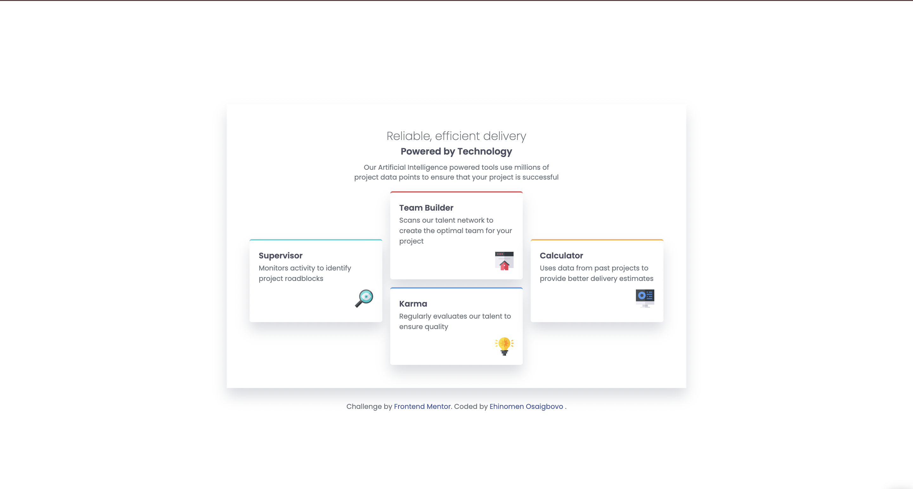

# Frontend Mentor - Four card feature section solution

This is a solution to the [Four card feature section challenge on Frontend Mentor](https://www.frontendmentor.io/challenges/four-card-feature-section-weK1eFYK). Frontend Mentor challenges help you improve your coding skills by building realistic projects.

## Table of contents

- [Overview](#overview)
  - [The challenge](#the-challenge)
  - [Screenshot](#screenshot)
  - [Links](#links)
- [My process](#my-process)
  - [Built with](#built-with)
  - [What I learned](#what-i-learned)
  - [Continued development](#continued-development)
  - [Useful resources](#useful-resources)
  - [AI Collaboration](#ai-collaboration)
- [Author](#author)
- [Acknowledgments](#acknowledgments)

## Overview

### The challenge

Users should be able to:

- View the optimal layout for the site depending on their device's screen size
- Read the text clearly on both mobile and desktop screens
- See each card styled with its own top border accent and consistent spacing

### Screenshot

### Links

- Solution URL: Add your solution URL here
- Live Site URL: Add your live site URL here

## My process

### Built with

- Semantic HTML5 markup
- CSS custom properties
- Flexbox
- CSS Grid
- Mobile-first workflow
- Sass

### What I learned

This challenge helped me understand how to build a responsive layout using CSS Grid and Flexbox together. I learned how to structure the card layout for mobile-first development and then apply a desktop breakpoint to reposition the cards into the final pattern.

I also got more comfortable with:

- using variables for color and typography consistency
- setting up a mobile-first layout and then enhancing it for larger screens
- working with spacing, borders, and shadows to match a design reference

### Continued development

I want to keep improving my responsive layout skills and become more confident with CSS Grid placement for more complex card and dashboard-style interfaces. I also want to keep practicing writing cleaner, more maintainable SCSS.

### Useful resources

- [MDN Web Docs - CSS Grid](https://developer.mozilla.org/en-US/docs/Web/CSS/CSS_grid_layout)
- [MDN Web Docs - Flexbox](https://developer.mozilla.org/en-US/docs/Learn/CSS/CSS_layout/Flexbox)
- [Frontend Mentor Community](https://www.frontendmentor.io/community)

### AI Collaboration

I used GitHub Copilot to help me think through the layout and debug spacing issues while building the responsive design. It was especially useful for checking the grid structure, understanding breakpoint behavior, and refining the card placement for the desktop version.

## Author

- Github - [Ehicodes](https://github.com/Ehicodes)
- Frontend Mentor - [@Ehicodes](https://www.frontendmentor.io/profile/@Ehicodes)
- X - [@Ehinomen_01](https://x.com/Ehinomen_01)

## Acknowledgments

- Thanks to Frontend Mentor for providing this challenge and design.
- Thanks to the community for inspiration and learning resources.

